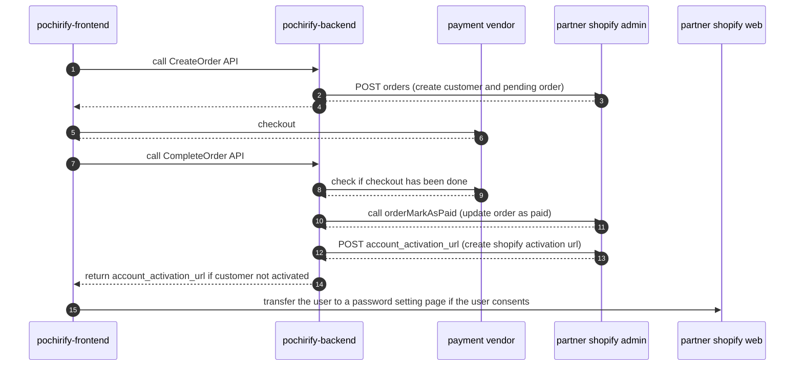
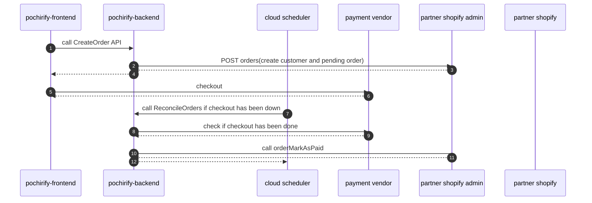
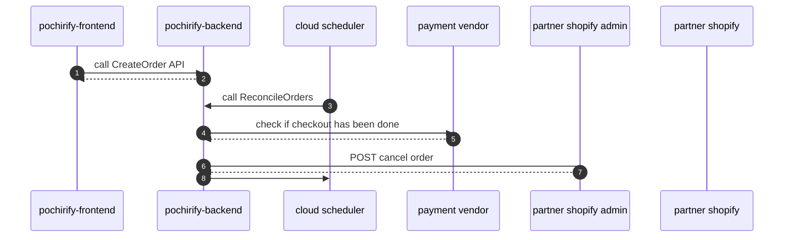

# Pochirfy is a EC platform that gathers new users and transfers user data to partner's EC site with UI specialized for first-time users.
Partners are only those vendors that have shopify EC site.
(this app don't actually sell products, and is not completed)

## words

- user: buyer
- customer (account): customer account of shopify
    - customer and email are one on one
        - (all order records are merged based on email within shopify)
    - activation
        - before activated
            - the case that a customer does not have a password
        - after activated
            - the case that a customer has a password
- payment vendor: paypay, fincode, applePay, googlePay servers
- partner: a vendor that sells actual products
- shopify admin: shopify admin api server

## Sequence

I. When user returns to pochirify-frontend after checkout

II. When user don’t return to pochirify-frontend after checkout
- (ex) when user kill pochirify-frontend after checkout with paypay

Ⅲ. when user don’t checkout after calling CreateOrder API

